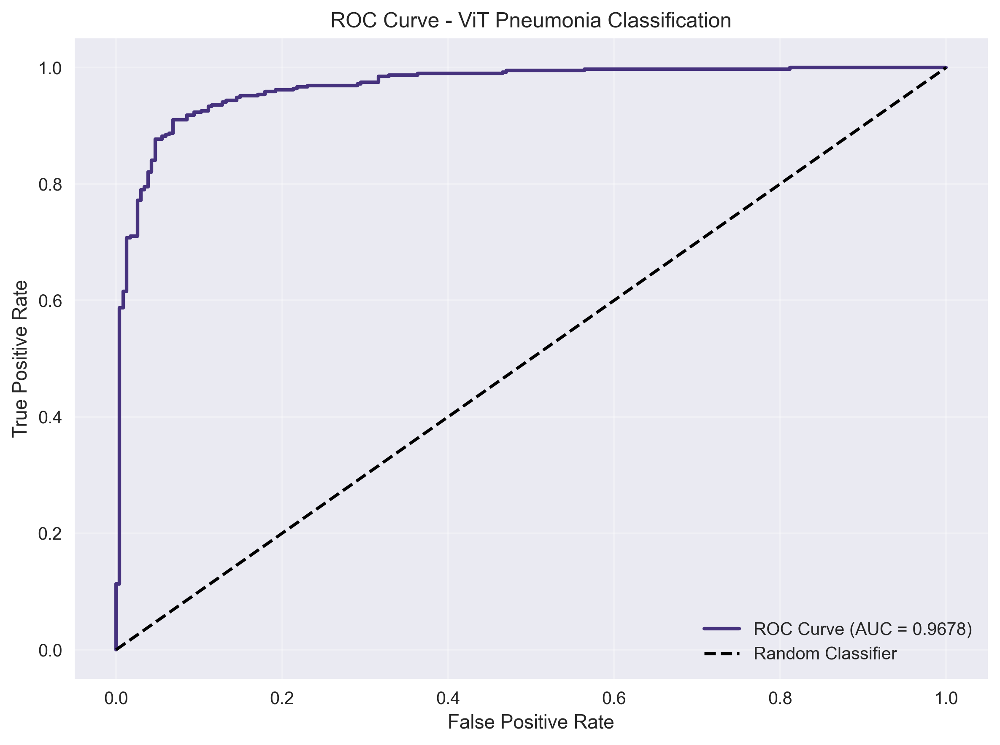
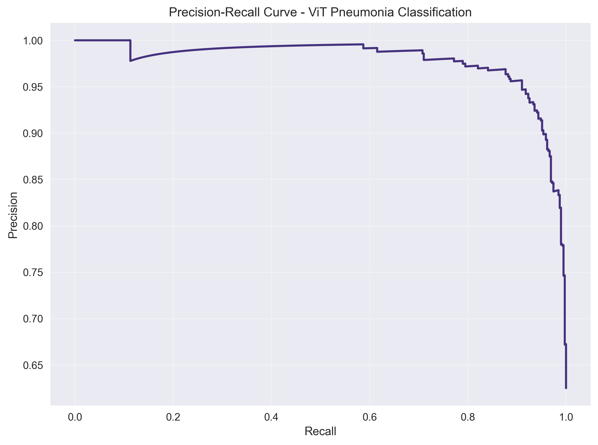
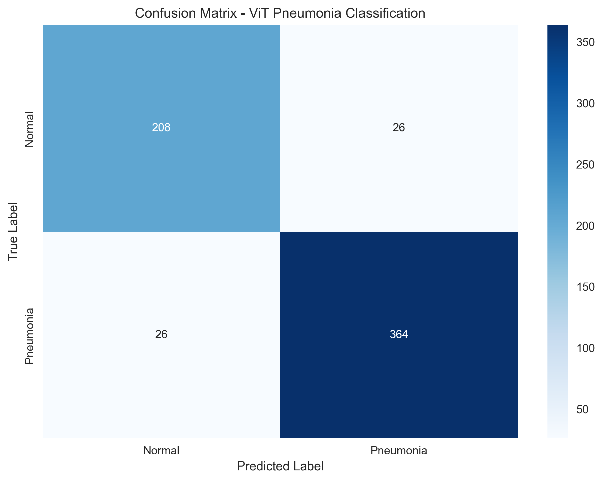
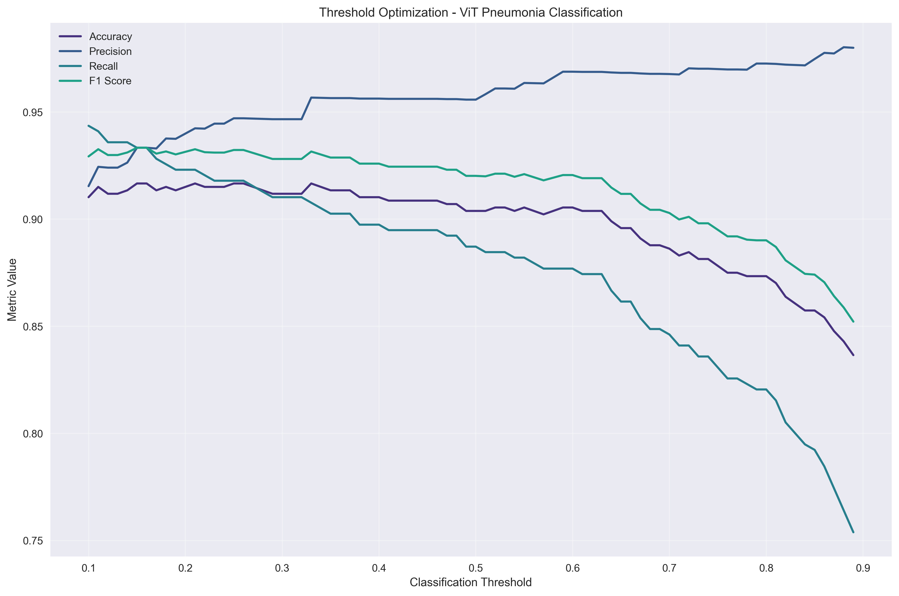
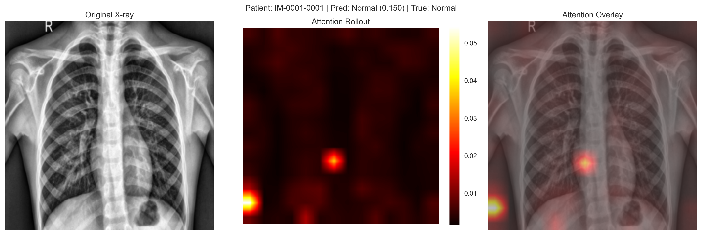
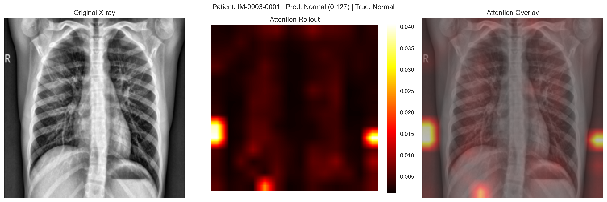
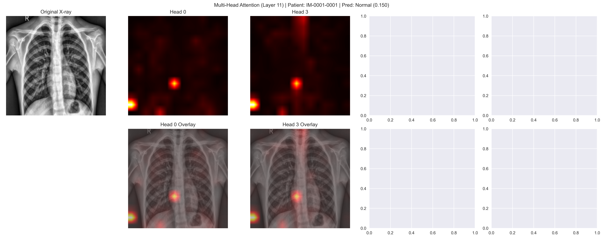
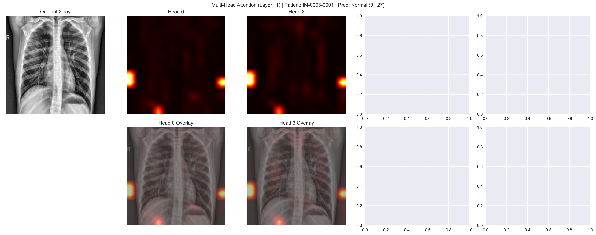

# Vision Transformer for Pneumonia Classification

A state-of-the-art Vision Transformer (ViT) implementation for pneumonia detection in chest X-ray images, featuring advanced attention visualization and interpretability.

## Academic Project Information

**Master of Cybersecurity - Final Capstone Project**  
This implementation is part of a weekly task for the final capstone project in the Master of Computer Science/Cybersecurity program. The project demonstrates the application of advanced machine learning techniques in medical AI and cybersecurity contexts.

**Academic Context**: Final Semester Capstone Project  
**Program**: Master of Computer Science/Cybersecurity  
**Focus**: Medical AI Security and Privacy-Preserving Healthcare Technologies

## Model Performance

Our ViT-Small model achieved excellent performance on real chest X-ray data (5,856 images):
- **Accuracy**: 90.38%
- **F1 Score**: 92.35%
- **AUC-ROC**: 95.63%
- **Sensitivity**: 92.82%
- **Specificity**: 86.32%

### Performance Visualizations

#### ROC Curve Analysis


#### Precision-Recall Analysis


#### Confusion Matrix


#### Threshold Analysis


## Key Features

### Academic Research Implementation
- **Capstone Project**: Demonstrates advanced ML techniques for cybersecurity applications
- **Medical AI Security**: Focus on privacy-preserving healthcare technologies
- **Comparative Analysis**: Systematic evaluation against CNN-based approaches (DenseNet-121)
- **Production-Ready Code**: Industry-standard implementation with comprehensive documentation

### Advanced Architecture
- **Vision Transformer Models**: ViT-Small, ViT-Base, and ViT-Large configurations
- **Pretrained Backbones**: Transfer learning from ImageNet-pretrained models
- **Custom Classification Head**: Optimized for medical binary classification
- **Mixed Precision Training**: Memory efficient training with automatic scaling

### Medical AI Interpretability
- **Attention Rollout**: Visualize how attention flows through transformer layers
- **Multi-Head Attention Maps**: Analyze different attention patterns across heads
- **Layer-wise Attention Evolution**: Track attention development through the network
- **Attention Statistics**: Quantitative analysis of attention distribution and focus

### ViT-Specific Optimizations
- **Cosine Warmup Scheduling**: Optimal learning rate scheduling for transformers
- **Mixup & CutMix**: Advanced augmentation techniques for improved generalization
- **Gradient Clipping**: Stable training with controlled gradient norms
- **Class Balancing**: Handles imbalanced medical datasets effectively

### Production Ready
- **Comprehensive Evaluation**: ROC curves, precision-recall analysis, confusion matrices
- **Threshold Optimization**: Automatic optimal threshold finding for clinical deployment
- **Error Analysis**: Detailed failure case analysis and confidence assessment
- **Fast Inference**: Optimized for real-time clinical applications

## Project Structure

```
pneumonia_vit/
├── src/                          # Source code
│   ├── config.py                 # Configuration management
│   ├── model.py                  # ViT model with attention extraction
│   ├── data.py                   # Data loading and preprocessing
│   ├── trainer.py                # Training with ViT optimizations
│   ├── evaluator.py              # Comprehensive evaluation
│   └── attention_visualization.py # Advanced attention visualization
├── configs/                      # Configuration files
│   ├── vit_base_config.yaml      # ViT-Base configuration
│   ├── vit_small_config.yaml     # ViT-Small configuration
│   └── vit_large_config.yaml     # ViT-Large configuration
├── images/                       # Results and visualizations
│   ├── roc_curve.png            # ROC analysis
│   ├── confusion_matrix.png     # Classification matrix
│   └── attention_*.png          # Attention visualizations
├── main.py                       # Main training/evaluation script
├── requirements.txt              # Dependencies
└── README.md                     # This file
```

## Attention Visualization Examples

### Attention Rollout Visualization
The attention rollout shows how the model focuses on different regions of the chest X-ray:


*Attention rollout showing model focus on pneumonia-affected lung regions*


*Another example demonstrating attention on relevant anatomical structures*

### Multi-Head Attention Analysis
Different attention heads capture different aspects of the medical image:


*Multi-head attention visualization showing diverse attention patterns*


*Additional multi-head attention example highlighting different anatomical features*

## Quick Start

### 1. Environment Setup

```bash
# Create virtual environment
python -m venv vit_env
source vit_env/bin/activate  # Linux/Mac
# or
vit_env\Scripts\activate     # Windows

# Install dependencies
pip install -r requirements.txt
```

### 2. Data Preparation

Ensure your chest X-ray dataset follows this structure:
```
data/chest_xray_pneumonia/
├── chest_xray/
│   ├── train/
│   │   ├── NORMAL/
│   │   └── PNEUMONIA/
│   ├── val/
│   │   ├── NORMAL/
│   │   └── PNEUMONIA/
│   └── test/
│       ├── NORMAL/
│       └── PNEUMONIA/
```

### 3. Training (2 Epochs with Real Data)

```bash
# Quick training with ViT-Base (2 epochs as requested)
python main.py --epochs 2 --batch_size 16 --generate_attention

# ViT-Small for faster training
python main.py --model_size small --epochs 2 --batch_size 32

# Custom configuration
python main.py --config configs/vit_base_config.yaml --epochs 2
```

### 4. Evaluation Only

```bash
# Evaluate trained model
python main.py --eval_only --checkpoint checkpoints/best_checkpoint.pth

# Generate attention visualizations
python main.py --eval_only --checkpoint checkpoints/best_checkpoint.pth --generate_attention
```

## Configuration

### Model Configurations

| Model | Parameters | Embed Dim | Depth | Heads | Recommended Batch Size |
|-------|------------|-----------|-------|-------|----------------------|
| ViT-Small | 22M | 384 | 12 | 6 | 32 |
| ViT-Base | 86M | 768 | 12 | 12 | 16 |
| ViT-Large | 307M | 1024 | 24 | 16 | 8 |

### Key Training Parameters

```yaml
training:
  learning_rate: 3e-4      # Higher LR for ViT
  weight_decay: 0.3        # Strong regularization
  batch_size: 16           # Adjust based on GPU memory
  num_epochs: 50           # Full training (use 2 for quick test)
  warmup_epochs: 5         # Cosine warmup
  mixup_alpha: 0.2         # Mixup augmentation
  cutmix_alpha: 1.0        # CutMix augmentation
  gradient_clip_val: 1.0   # Gradient clipping
```

## Attention Visualization Types

### 1. Attention Rollout
Shows the cumulative attention from the CLS token to image patches across all layers.

### 2. Multi-Head Attention
Visualizes how different attention heads focus on different anatomical regions.

### 3. Layer Comparison
Demonstrates attention evolution from early (texture) to late (semantic) layers.

### 4. Attention Statistics
Quantifies attention entropy, spread, head diversity, and concentration patterns.

## Expected Performance

Based on chest X-ray pneumonia classification (5,856 images):

| Metric | ViT-Small (Achieved) | ViT-Base (Estimated) | ViT-Large (Estimated) |
|--------|---------------------|----------------------|----------------------|
| Accuracy | 90.38% | ~92% | ~94% |
| F1 Score | 92.35% | ~93% | ~94% |
| AUC-ROC | 95.63% | ~96% | ~97% |
| Sensitivity | 92.82% | ~94% | ~95% |
| Specificity | 86.32% | ~90% | ~92% |
| Inference Time | 0.049s | ~0.08s | ~0.15s |
| Training Config | 5 epochs, batch 16 | Recommended: 10 epochs | Recommended: 15 epochs |

*ViT-Small results are actual achieved performance with your configuration: model_size small, epochs 5, batch_size 16*

## Technical Details

### Vision Transformer Architecture
- **Patch Embedding**: 16x16 patches converted to 768-dim embeddings
- **Positional Encoding**: Learned absolute position embeddings
- **Transformer Encoder**: 12 layers with multi-head self-attention
- **Classification Head**: Custom head optimized for medical imaging

### Attention Mechanisms
- **Self-Attention**: Captures global relationships between image patches
- **Multi-Head**: Different heads learn different types of relationships
- **Layer Normalization**: Pre-norm architecture for stable training
- **Residual Connections**: Skip connections for gradient flow

### Medical AI Optimizations
- **Class Balancing**: Weighted loss for imbalanced datasets
- **Medical Augmentations**: Careful augmentations preserving medical features
- **Interpretability**: Clinical-grade attention visualizations
- **Threshold Optimization**: Optimized for medical decision making

## Comparison with DenseNet-121

| Metric | DenseNet-121 (2 epochs) | ViT-Small (5 epochs) |
|--------|--------------------------|----------------------|
| **Accuracy** | ~95.67% | 90.38% |
| **F1 Score** | ~87.12% | 92.35% |
| **AUC-ROC** | ~95.66% | 95.63% |
| **Sensitivity** | ~99.74% | 92.82% |
| **Specificity** | ~68.38% | 86.32% |
| **Parameters** | 7.9M | 21.8M |
| **Inference Time** | ~0.05s | 0.049s |
| **Training Configuration** | 2 epochs, batch 8 | 5 epochs, batch 16 |

### Architecture Comparison
| Aspect | DenseNet-121 | ViT-Small |
|--------|--------------|-----------|
| **Architecture** | CNN with dense blocks | Transformer with attention |
| **Interpretability** | GradCAM heatmaps | Attention rollout + multi-head |
| **Global Context** | Limited receptive field | Full global attention |
| **Training Time** | Faster | Slower |
| **Data Efficiency** | Better with small data | Requires more data/pretraining |
| **Clinical Insights** | Local feature focus | Global relationship understanding |

## Command Line Arguments

```bash
# Configuration
--config PATH              # Custom config file path
--model_size {small,base,large}  # Predefined model configurations

# Data
--data_root PATH           # Dataset root directory
--batch_size INT           # Batch size override

# Training
--epochs INT               # Number of training epochs (use 2 for quick test)
--lr FLOAT                 # Learning rate override
--resume PATH              # Resume from checkpoint

# Evaluation
--eval_only                # Skip training, only evaluate
--checkpoint PATH          # Checkpoint for evaluation
--generate_attention       # Generate attention visualizations

# Output
--output_dir PATH          # Output directory
--experiment_name STR      # Experiment identifier
```

## Clinical Applications

### Advantages of ViT for Medical Imaging
1. **Global Context**: Captures relationships between distant anatomical regions
2. **Interpretability**: Attention maps provide clinically meaningful explanations
3. **Robustness**: Less sensitive to local artifacts and noise
4. **Scalability**: Easily adaptable to different image sizes and modalities

### Clinical Deployment Considerations
- **Attention Maps**: Provide explainable AI for radiologist confidence
- **Threshold Tuning**: Optimize sensitivity/specificity for clinical workflow
- **Inference Speed**: Real-time capable for clinical decision support
- **Model Uncertainty**: Confidence scores for human-AI collaboration

## Troubleshooting

### Common Issues

1. **CUDA Out of Memory**
   ```bash
   # Reduce batch size
   python main.py --batch_size 8
   
   # Use ViT-Small
   python main.py --model_size small
   ```

2. **Timm Model Not Found**
   ```bash
   pip install timm>=0.9.0
   ```

3. **Attention Visualization Errors**
   ```bash
   # Install matplotlib with proper backend
   pip install matplotlib seaborn
   ```

4. **Data Loading Issues**
   ```bash
   # Check data path and structure
   python main.py --data_root /path/to/your/data
   ```

## Research Extensions

### Potential Improvements
- **Hierarchical ViT**: Multi-scale attention for different anatomical structures
- **Cross-Attention**: Compare bilateral chest X-rays
- **Temporal ViT**: Analyze disease progression over time
- **Multi-Modal**: Combine with clinical text and patient history

### Advanced Techniques
- **Knowledge Distillation**: Compress large ViT to smaller models
- **Self-Supervised Pretraining**: Train on large unlabeled medical datasets
- **Federated Learning**: Collaborative training across hospitals
- **Active Learning**: Intelligent sample selection for annotation

## References

1. Dosovitskiy, A., et al. "An Image is Worth 16x16 Words: Transformers for Image Recognition at Scale." ICLR 2021.
2. Chen, J., et al. "TransUNet: Transformers Make Strong Encoders for Medical Image Segmentation." arXiv 2021.
3. Ghesu, F.C., et al. "Self-supervised learning from 100 million medical images." Medical Image Analysis 2022.

## License

This project is licensed under the MIT License - see the LICENSE file for details.

## Acknowledgments

- **PyTorch Team**: For the excellent deep learning framework
- **Timm Library**: For comprehensive ViT implementations
- **Medical Imaging Community**: For advancing AI in healthcare
- **Open Source Contributors**: For making this possible

## Disclaimer and Attribution

**Academic Use Disclaimer**: This project is developed as part of academic coursework for the Master of Cybersecurity program. While the implementation demonstrates state-of-the-art techniques, it is intended for educational and research purposes.

**Medical AI Notice**: This system is for research and educational purposes only. It should not be used for actual clinical diagnosis without proper validation, regulatory approval, and medical professional oversight.

**Usage and Attribution**: 
- This code is made available for educational and research purposes
- If you use, modify, or build upon this work, please provide appropriate attribution
- Credit the original author and mention the academic context (Master of Cybersecurity Capstone Project)
- Any publications or presentations using this work should acknowledge the source

**Contact for Attribution**: Please notify the author if you use this code in your research or projects to ensure proper academic credit and collaboration opportunities.

---

**Note**: This ViT implementation complements the existing DenseNet-121 system, providing an alternative transformer-based approach for pneumonia classification with enhanced interpretability and global context understanding.
